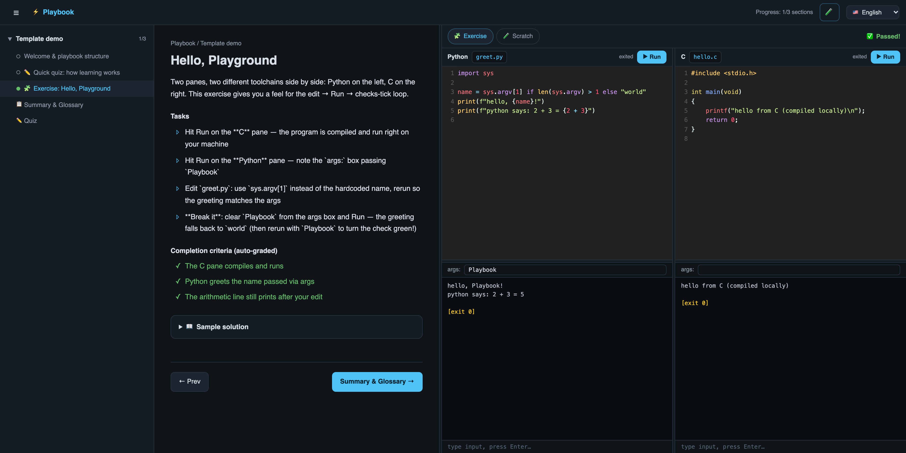

# play-book-template

A plug-and-play shell for building **interactive learning playbooks**: a single Go binary serving a bilingual reader, inline quizzes, and an auto-graded code playground that compiles and runs real programs on the learner's machine.

**Why it exists:** turning a good text (a guide, a book, your own notes) into a Codecademy-style course normally means building an app. This template already *is* the app — you (or a content-generating agent) supply only the `content/` directory, and everything else — layout, navigation, language switching, progress tracking, gating, auto-grading — just works.


*The shipped demo chapter: navigation drawer with progress, content + tasks in the middle, and Python & C panes compiled & run locally on the right — auto-graded checks all green.*

## Table of contents

- [Features](#features)
- [Requirements](#requirements)
- [Quick start](#quick-start)
- [Usage](#usage)
- [Configuration](#configuration)
- [Project structure](#project-structure)
- [Theming](#theming)
- [Toolchains](#toolchains)
- [Bundled skills](#bundled-skills-claudeskills)
- [Self-hosting with Docker](#self-hosting-with-docker)
- [Backend contract (stable interfaces)](#backend-contract-stable-interfaces)
- [Platform support & roadmap](#platform-support--roadmap)
- [Content licensing](#content-licensing)

## Features

- **Split layout**: lesson content on the left; an always-available playground on the right, showing **1 or 2 code panes** per exercise (two independent processes — enough for client/server labs).
- **Three gated section types**: reading (mark-as-done), inline quiz (perfect score), exercise (regex checks over real program output). Chapters close with a summary, glossary, and final quiz.
- **Real code execution** through a pty: unbuffered interactive stdio, an `args:` box, stdin input, process-group cleanup.
- **Toolchains as data**: the playground is language-agnostic — `content/toolchains.json` says how each pane builds and runs (shell commands). Presets: `c`, `cpp`, `python`, `node`, `kotlin` (Kotlin CLI), `java`, `rust`, `rust-cargo`; add your own for make, Gradle, a Python venv with libraries, and so on.
- **Multilingual content** via `.vi.md` / `.en.md` file pairs (any locale set), with a runtime language switcher.
- **Progress persistence** in SQLite (pure-Go driver — no CGO), per-playbook via `app_id`.
- **Sample solutions** behind a disclosure, with copy-into-editor and a completion fallback.
- **Agent-ready**: bundled skills plan the curriculum, set up toolchains, and generate content; a demo chapter doubles as the reference sample.

## Requirements

- Go ≥ 1.26 to build.
- Only the toolchains your exercises use (see [Toolchains](#toolchains)) — the `playbook-setup-env` skill defines, installs and verifies exactly what your curriculum needs.
- macOS or Linux (Windows: see [roadmap](#platform-support--roadmap)).

## Quick start

```bash
# 1. Copy the template
cp -R play-book-template my-playbook && cd my-playbook

# 2. Make it yours: app_id, brand, tagline, port, locales, default_toolchain
$EDITOR content/course.json

# 3. Install & check the toolchains the demo uses (skip what's already installed)
sh env/setup-macos.sh c python        # or env/setup-debian.sh on Linux
go run . toolchains verify c python

# 4. Build & run
go build -o my-playbook . && ./my-playbook
```

The demo chapter (`content/chapters/ch01/`) shows every content type working — including a two-pane exercise mixing Python and C. Delete it once your real chapters exist.

## Usage

The intended flow is agent-driven, as one chain or as separate steps:

| Step | Skill | What it does |
|------|-------|--------------|
| all-in-one | `playbook-bootstrap` | chains the three steps below; you only approve at the gates |
| 1. plan | `playbook-plan` | reads `document-sources/`, proposes a chapter/section syllabus + **toolchain scope** as `curriculum.md` for your approval |
| 2. environment | `playbook-setup-env` | defines (`content/toolchains.json`), installs, records (`env/`) & verifies **only** the toolchains the plan scopes |
| 3. content | `playbook-generate` | writes chapters (manual: one per invocation; auto: parallel sub-agents with a pre-flight brief you approve) |

Manual authoring works too: follow the schemas in `.claude/skills/playbook-generate/reference.md`, then rebuild.

## Configuration

All in `content/course.json`:

| Field | Purpose |
|-------|---------|
| `app_id` | names the user-data dir (progress DB). Set once, **never rename** |
| `brand`, `tagline`, `subtitle` | per-locale app name and home-hero text |
| `brand_icon` | optional topbar/favicon line icon: `sprout` (default), `book`, `code`, `terminal`, `flask`, `cpu`, `globe`, `layers`, or `none` |
| `default_toolchain` | used by Scratch panes and panes without their own `toolchain` |
| `port` | this playbook's default port (`--port` overrides) |
| `locales`, `default_locale` | content languages, fallback order |

Runtime flags: `--port`, `--host` (default `127.0.0.1`; `0.0.0.0` for Docker/LAN), `--data` (data dir), `--env-dir` (toolchain environment, see [Toolchains](#toolchains)), `--no-open`.

Toolchain CLI: `playbook toolchains list` (what's defined/installed, and `ENV_DIR`) and `playbook toolchains verify [name...]` (runs each toolchain's scratch program through the real runner).

## Project structure

```
main.go                  # flags, embed, data dir, serve; `toolchains` CLI
internal/
  content/   # manifest + localized markdown/JSON loading
  runner/    # language-agnostic: stage files, run toolchains.json commands in a pty
  server/    # HTTP API + playground WebSocket
  store/     # SQLite progress/settings/attempts
web/         # SPA (vanilla JS + CodeMirror + highlight.js, vendored)
  tokens.css             # design-token entry point (see Theming)
  vendor/verdant/        # Elevated Botanical M3 tokens (generated CSS, verbatim)
  styles.css             # shell styles — colours/type/shape only via token vars
  code-theme.css         # One Dark Vivid Italic syntax for editor + code blocks
env/
  setup-macos.sh         # environment recipes per toolchain (local)
  setup-debian.sh        # … and for hosts; the Dockerfile runs it
content/
  course.json            # manifest (see Configuration)
  toolchains.json        # how panes build & run (see Toolchains)
  chapters/chNN/         # sections/, quizzes/, exercises.json,
                         # starter/, solution/, summary, glossary, quiz, assets/
```

## Theming

The shell is design-system agnostic: `styles.css` and `code-theme.css` never hard-code colours, fonts, radii or spacing. They read CSS variables, all loaded through one file, `web/tokens.css`. The template ships with **Elevated Botanical Material 3** (Montserrat + Inter, dark-first) wired in, plus a light theme (topbar toggle; `data-theme="light"` on `<html>`, remembered per browser). UI icons are inline SVG line icons, and content uses no emoji.

**Theming contract**: any token set that defines these variables can replace the shipped one. Material 3 token exports already use these names.

| Group | Variables |
|-------|-----------|
| Colour roles | `--color-{primary,tertiary,error}` and `--color-on-{primary,tertiary,error}`; `--color-{primary,secondary,tertiary}-container` and their `--color-on-…-container`; `--color-surface`, `--color-surface-container{-lowest,-low,,-high,-highest}`, `--color-on-surface{,-variant}`; `--color-outline{,-variant}`; `--color-scrim-modal`; `--text-link`, `--text-success` |
| Code chrome | `--palette-neutral-{5,10,100}`, `--palette-neutral-variant-{5,20,50,80}`, `--palette-primary-{25,80}` (or override the `--code-*` variables at the top of `code-theme.css`) |
| Typography | `--font-display`, `--font-body`; `--type-{display-lg-mobile,headline-md,title-md,body-lg,body-md,label-lg,label-md,label-sm}-{size,line,tracking}` (as used) |
| Shape / space | `--shape-{xs,sm,md,lg,full}`, `--shape-{button-border-radius-m,card-border-radius,chip-border-radius-all,input-border-radius-s}`; `--space-{xxs,xs,sm,base,md,lg,xl,2xl,3xl}` |
| Motion / depth | `--motion-duration-{short-3,medium-1}`, `--motion-easing-{standard,emphasized}`; `--elevation-level-{1,3}`; `--z-{drawer,scrim}` |
| States | `--state-{hover,pressed}-pct`; `--focus-ring-{color,width,offset}` |

Dark values go on `:root`, and light values go under `[data-theme="light"]`. Run `grep -oh 'var(--[a-z0-9-]*' web/*.css | sort -u` to get the exact list.

- **Resync Elevated Botanical**: run `npm run tokens` in the design-system repo. Then copy the files that `web/tokens.css` imports from `packages/tokens/dist/css/` into `web/vendor/verdant/`.
- **Swap the design system**: drop the new token CSS into `web/vendor/<name>/`, point the `@import`s in `web/tokens.css` at it, and fill any gaps in the contract with aliases in the same file (e.g. `--text-link: var(--color-primary);`).
- **Code colours** (One Dark Vivid Italic) live in `web/code-theme.css`. Code surfaces stay dark in both themes.

## Toolchains

The playground is only an interface: it stages a pane's files, runs a toolchain's `build` then `run` shell commands in a pty, and forwards args and stdin. **Which toolchains exist, and what they can use, is up to the environment** — your machine locally, the image when hosted — and the `playbook-setup-env` skill sets that up.

A toolchain is an entry in `content/toolchains.json`:

```json
{
  "name": "rust-cargo", "label": "Rust (Cargo)", "detect": ["cargo"],
  "sources": ["*.rs"], "stage": ["Cargo.toml", "Cargo.lock"],
  "layout": { "*.rs": "src" }, "workspace": "persistent",
  "build": "cargo build --quiet --offline",
  "run": "exec cargo run --quiet --offline -- \"$@\"",
  "scratch": [{ "name": "main.rs", "content": "…" }, { "name": "Cargo.toml", "content": "…" }]
}
```

Commands see `$ENTRY` (first source file of the pane), `$SRCS`, and `$ENV_DIR` — the playbook's private environment for venvs, libraries and prefetched dependencies (`--env-dir`, else `$PLAYBOOK_ENV_DIR`, else `<data>/env`; its `bin/` is first on `PATH`). `workspace: "persistent"` keeps a pane's build directory between Runs so make/cargo/gradle stay incremental. Full schema and patterns: [`playbook-generate/reference.md`](.claude/skills/playbook-generate/reference.md#toolchainsjson).

Presets shipped with the template:

| Name | Build | Run |
|------|-------|-----|
| `c` | `cc -Wall -Wextra -O0 -o prog $SRCS` | `./prog` |
| `cpp` | `c++ -std=c++17 -Wall -Wextra -O0 -o prog $SRCS` | `./prog` |
| `python` | — | `python3 -u $ENTRY` |
| `node` | — | `node $ENTRY` |
| `kotlin` | `kotlinc $SRCS -d prog.jar` | `kotlin -classpath prog.jar <MainKt>` (`.kts`: `kotlinc -script`) |
| `java` | `javac -d . $SRCS` | `java <Main>` |
| `rust` | `rustc --edition 2021 -o prog $ENTRY` (other `.rs` files load via `mod`) | `./prog` |
| `rust-cargo` | `cargo build --offline` (Cargo layout: `.rs` → `src/`) | `cargo run --offline` |

Each pane declares its `toolchain` in `exercises.json` (first file listed = entry point); omitted panes use `default_toolchain` or inference (first definition whose `sources` match). `/api/course` reports which toolchains are installed. Adding a toolchain = an entry in `toolchains.json` + a recipe case in `env/setup-*.sh`; no Go changes. `content/` is embedded, so an edited `toolchains.json` needs a rebuild + restart; installing a tool doesn't (detection runs on every Run).

A pane that fails with *toolchain not installed* or *unknown toolchain* means the environment or the definition is missing: run the `playbook-setup-env` skill, or by hand `sh env/setup-<os>.sh <name>` then `go run . toolchains verify <name>`. Editor highlighting is per file extension (`EXT_META` in `web/app.js` + a CodeMirror mode in `web/vendor/`); unknown extensions edit as plain text.

## Bundled skills (`.claude/skills/`)

`playbook-bootstrap` (the chain), `playbook-plan` (curriculum + toolchain scope), `playbook-setup-env` (scoped installs, verified with the runner's own commands), `playbook-generate` (content; auto mode shows a pre-flight brief — task→model table **and the sub-agent verification criteria** — before spawning anything). Schemas live in `playbook-generate/reference.md`.

## Self-hosting with Docker

The binary builds with `CGO_ENABLED=0` (pure-Go SQLite), so packaging is one multi-stage build. A `Dockerfile` ships with the template:

```bash
docker build --build-arg TOOLCHAINS="c python" -t my-playbook .
docker run -p 4360:4360 -v playbook-data:/data my-playbook
```

`TOOLCHAINS` installs only what your curriculum scopes, using the recipes in `env/setup-debian.sh` (presets plus whatever `playbook-setup-env` added for your own toolchains); `$ENV_DIR` is baked into the image at `/opt/playbook-env`. The container runs as a non-root user and binds `0.0.0.0` **inside the container** only. ⚠️ The playground executes arbitrary code by design and the app has **no authentication or per-user separation** — one container = one learner (or a trusted household). Don't expose it to the public internet.

## Backend contract (stable interfaces)

The backend is deliberately small (~1.8k lines of Go), and the frontend + all content depend on only four stable surfaces. Keep them intact and the backend can evolve freely — or even be reimplemented in another stack — without touching any playbook's content:

1. **HTTP API**: `/api/course` (incl. `toolchains` availability + `toolchain_defs` name/label/scratch), `/api/section/{ch}/{id}`, `/api/progress`, `/api/chapter/{ch}/{summary,glossary,quiz[/{id}]}`, `/api/quiz/...{attempt,attempts}`, `/api/exercises/{ch}`, `/api/settings`, `/assets/{ch}/{name}` — same JSON shapes (see `internal/server/server.go`; note: quiz endpoints strip `answer`).
2. **WebSocket** `/ws/run`: in `{op: run|stdin|kill, toolchain, files, args, data}` / out `{type: out|status|exit|error, data, code}`, one program per socket, pty semantics, process-group kill.
3. **Storage**: SQLite tables in `internal/store/store.go`; progress keys `chNN/<section-id>` must survive any change.
4. **Toolchain definitions**: the `content/toolchains.json` schema — fields, `/bin/sh -c` execution with args as `"$@"`, the `$ENTRY` / `$SRCS` / `$ENV_DIR` variables, `$ENV_DIR/bin` first on `PATH` (see `internal/runner/runner.go`).

## Platform support & roadmap

- **macOS / Linux**: supported (pty + process-group semantics are POSIX).
- **Windows**: not native yet — the runner leans on Unix ptys and `kill(-pid)`. Works fine under **WSL2** today. Native support (ConPTY + Job Objects, and a shell other than `/bin/sh` for toolchain commands) is a roadmap item; `internal/runner` is the only code that needs it.
- Roadmap ideas: editor autocomplete, notes/highlights, search, flashcards, per-playbook pane layouts.

## Content licensing

The template code is yours to reuse. The **content you generate from sources is bound by those sources' licenses** — record the license in `curriculum.md`; for restrictive licenses (e.g. CC BY-NC-ND) keep the built binary+content personal-use only and never distribute it.
